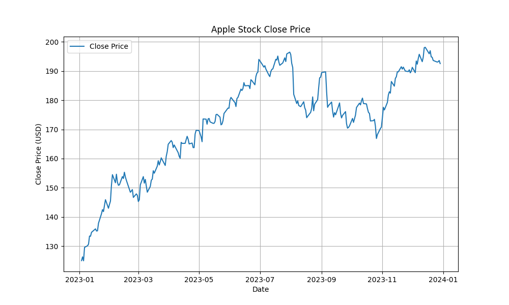
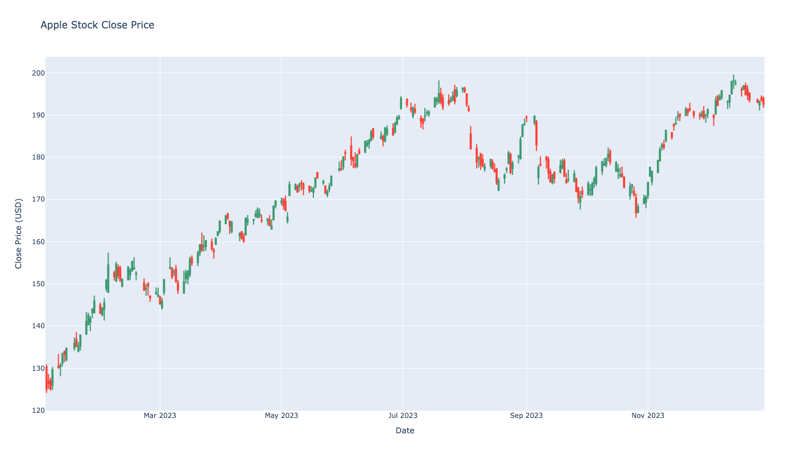

# Big Data & Analytics: Final Assignment – Apple's Stock Price Analysis (2023-2024)

This project is for analysing Apple's stock prices in the timeframe between 2023 to 2024 for University subject Big Data & Analytics

## Matplotlib

## Plotly

# Requirements
Install PostgreSQL on you local machine or configure settings.py in a way that you will be able to connect to your database.

## How to setup:
    python -m venv .venv
    source .venv/bin/activate
    pip install -r requirements.txt
    python main.py setup

## How to run:
    python main.py present
